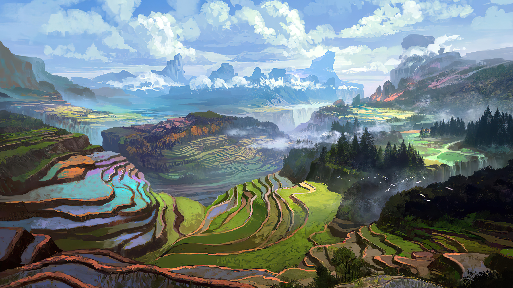
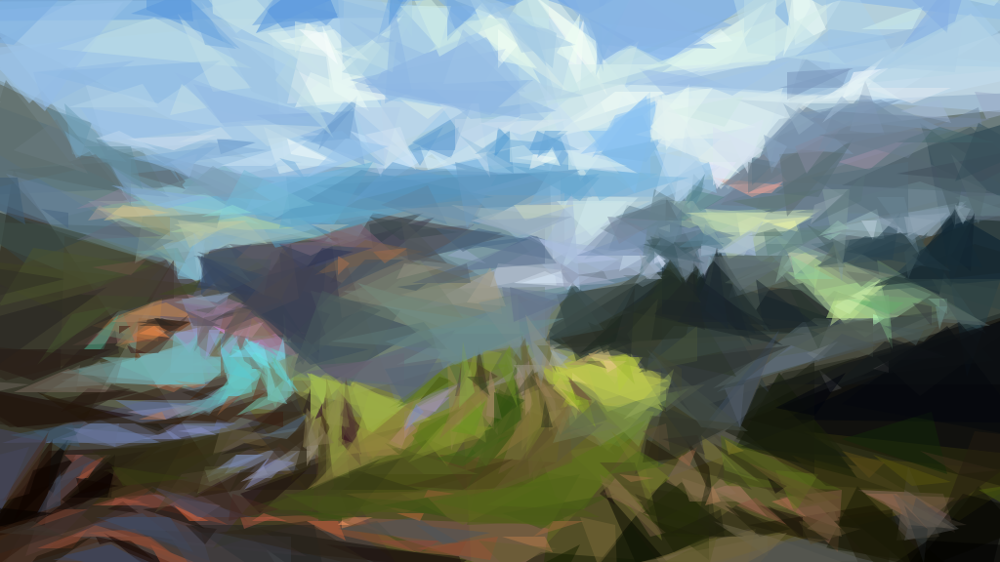
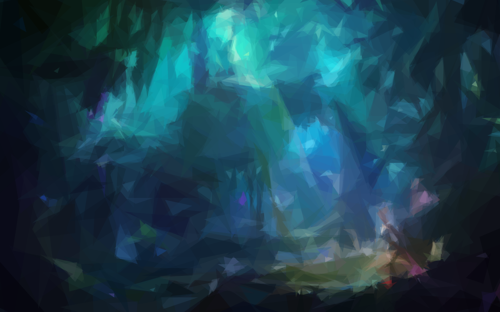

#  gdraw 用几何图形画图

非原创，主要用来学习，原始仓库：[https://github.com/fogleman/primitive](https://github.com/fogleman/primitive)

# Example

原始图


```
./gdraw -i beauty.jpg -n 1000  -o ./beauty.out.png
```

处理结果


原始图



```
./gdraw -i terraces.jpg -n 1000  -o ./terraces.out.png
```

处理结果




原始图


```
./gdraw -i wonderland.jpg -n 1000  -o ./wonderland.out.png
```

处理结果


